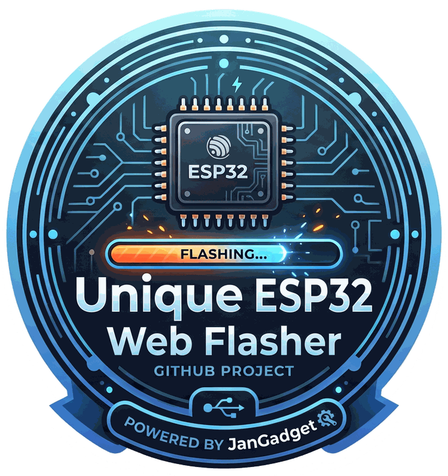

# Unique ESP32 Web Flasher

A browser-based flasher for [pfsense-status-esp32](https://github.com/UniqueDroid/pfsense-status-esp32), [fritzbox-status-esp32](https://github.com/UniqueDroid/fritzbox-status-esp32) (both LilyGO T-Display S3), [PicoRead](https://github.com/UniqueDroid/PicoRead) (Xteink X3/X4), and [PicoWatch](https://github.com/UniqueDroid/PicoWatch) (PCB V3/ESP32-S3 or real Watchy V2/ESP32-PICO-D4) - flash a blank (or already-flashed) board straight from Chrome/Edge over USB, no PlatformIO or IDE install required.

Built on [ESP Web Tools](https://github.com/esphome/esp-web-tools) (Apache-2.0), the same browser-flashing library used by ESPHome, Home Assistant and other ESP32 projects (including Bruce's own web launcher).

Link Unique ESP32 Web Flasher
https://uniquedroid.github.io/unique-esp-web-flasher

## How it works

- `index.html` is the landing page with one install button per project.
- `manifests/*.json` describe each build: bootloader + partition table + app firmware, at the flash offsets PlatformIO/arduino-cli use for each board. LilyGO T-Display S3 and PicoRead's Xteink X3/X4 (ESP32-C3) both put the bootloader at offset 0. **PicoWatch is the odd one out**: it ships two builds in one manifest (`chipFamily: "ESP32"` for real Watchy V2 hardware, `chipFamily: "ESP32-S3"` for PCB V3 - ESP Web Tools auto-picks the build matching the connected chip), and classic ESP32 (V2) puts its bootloader at offset **0x1000**, not 0 - only S2/S3/C3 use 0 (checked against `esp32.build.bootloader_addr`/`watchy.build.bootloader_addr` in the arduino-esp32 core's own `boards.txt`, not assumed).
- **All firmware binaries are mirrored into this repo** under `firmware/<project>/` and served same-origin via GitHub Pages. This is required, not just convenient: GitHub's release-asset downloads don't send `Access-Control-Allow-Origin`, so the browser's `fetch()` (which ESP Web Tools uses to load each manifest part) gets blocked by CORS if a part points directly at a `github.com`/`releases/download/...` URL - it fails with an opaque "Failed to fetch", not a CORS-specific error, but that's what it is.
- `.github/workflows/sync-firmware.yml` re-downloads the latest bootloader/partitions/firmware from all projects' GitHub releases every 3 hours (and on manual `workflow_dispatch`), commits them under a fixed local filename, and pushes. The manifests reference those fixed local paths, so they never need editing for a new release. PicoRead's release assets are already unprefixed (`bootloader.bin`/`partitions.bin`/`firmware.bin`); the status-esp32 projects and PicoWatch need a glob/exact-name pick to select the right board-specific asset out of a release (PicoWatch's release has one asset set per board revision - `firmware/picowatch-v2/` and `firmware/picowatch-v3/` pick out the `AllFaces-v20.ino*`/`AllFaces-v30.ino*` ones specifically, ignoring the other watchface examples' assets in the same release).
- `firmware/boot_app0.bin` is bundled directly (not synced) - it's a static file from the Arduino-ESP32 core, identical across all builds.

## Getting a new release to show up here immediately

Normally you just wait up to 3 hours for the sync workflow's next scheduled run. To force it right away: Actions tab → "Sync firmware from releases" → Run workflow (or `gh workflow run sync-firmware.yml`).

## Development

Any static file server works, e.g.:

```sh
python3 -m http.server 8080
```

Open `http://localhost:8080` - Web Serial requires either `localhost` or HTTPS.
